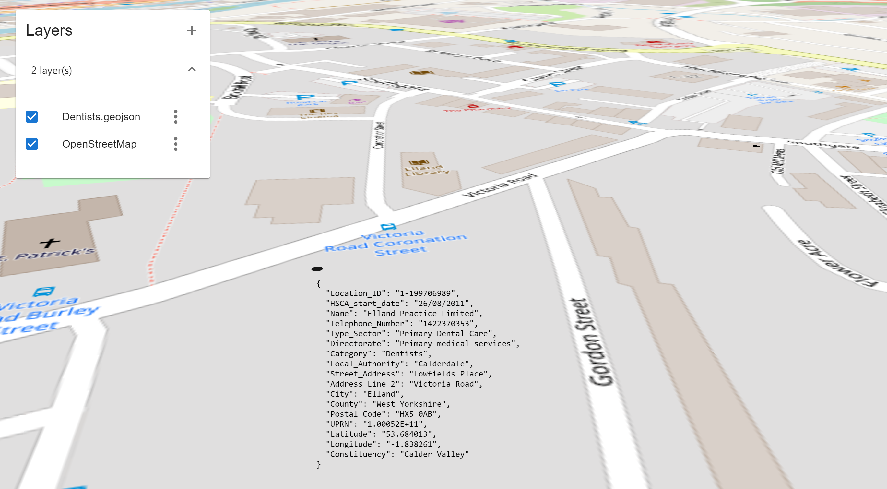

# gview

[In-browser viewer](https://gview.rwies.com) of 2D and 3D geographic data.

<i>
Tile data &copy; [OpenStreetMap](https://operations.osmfoundation.org/policies/tiles/) contributors \
Dentist data &copy; [UK Government](https://www.nationalarchives.gov.uk/doc/open-government-licence/version/3/)
</i>

## Description

gview is an in-browser viewer for geographic data that pulls visualisation from [deck.gl](https://deck.gl) and GIS ingestion tools from [loaders.gl](https://loaders/gl) and [turf](https://turfjs.org) to create an all-in-one geographic data exploration tool.

Some of gview's key features are:
- loading and displaying GIS files (.gpkg, .geojson)
- browsing individual feature data
- connecting to tile servers

## Getting Started

### Dependencies

These are probably not the minimum versions, but are what I am using to develop.
* yarn: 1.22.19
* npm: 9.5.1

### Executing program

- Install dependencies: `yarn install`
- Build first, to inject react-app-rewired pre-requisites: `yarn build`
- Start local server: `yarn start`

## Author
[Ryan Wiesenberg](https://rwies.com)

## License

This project is licensed under the [BSD 3 License](LICENSE).
